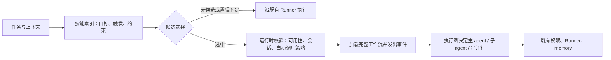

# 主流 Agent 技能机制对比

**日期：** 2026-08-10
**状态：** 外部产品调研完成；不构成 nanobot 方案决策
**范围：** 技能如何被发现、选择、加载、约束，以及与 subagent 的关系。仅使用产品官方公开文档。

## 1. 结论先行

成熟产品收敛到同一个基本结构：**常驻的是低成本的“技能索引/描述”，按需进入上下文的是完整工作流；由模型基于描述做相关性选择，但必须给用户与系统保留明确的强制/禁止开关。**

它们并不把“技能选择”做成一个纯关键词分类器，也不把所有 `SKILL.md` 永久塞进上下文。相反，通常分为三层：

1. **常驻指令（always-on）**：项目原则、稳定约束、路径范围；
2. **按需技能（on-demand）**：某一可识别用户目标的完整工作流、模板和辅助资源；
3. **隔离执行（fork/delegation）**：当该工作流本身适合独立产出时，携带明确任务在隔离子上下文运行，再回传结果。

这与 nanobot 当前“只提供目录、由模型自行 `read_file`”的机制相比，关键缺口不是技能文件格式，而是**由运行时记录并执行的选择与加载生命周期**。

## 2. 产品事实对比

| 产品 | 发现与选择 | 完整内容何时进上下文 | 显式控制 | 与 subagent 的关系 | 对 nanobot 的启示 |
| --- | --- | --- | --- | --- | --- |
| Claude Code | 常驻 `description` / `when_to_use`，模型据此决定是否调用；正文按需加载。 | 调用后正文作为单条消息留在会话中；再次调用同内容不重复注入；压缩后受预算约束。 | `/skill` 显式调用；可禁止模型自动调用、或隐藏用户入口。 | `context: fork` 可令 skill 的正文成为隔离 subagent 的任务；也可为子 agent 预装指定 skill。 | 把“可匹配描述”和“完整正文”拆开；skill 既可作主 agent 的上下文能力，也可作明确委派任务模板。 |
| GitHub Copilot | Copilot 根据用户 prompt 与 skill `description` 决定是否使用。 | 一旦选中，将 `SKILL.md` 注入 agent context。 | `allowed-tools` 可预批准，但未列出的工具仍要求确认。 | 此轮公开技能文档未给出与 subagent 的详细绑定机制。 | 自动选择可以由模型完成，但其输入必须是结构化、明确写出触发条件的 description；权限仍由既有机制处理。 |
| ChatGPT / Codex 插件技能 | `description` 决定模型何时“考虑”该 skill；正文放具体流程、安全约束与输出要求。 | 官方页面说明技能用于复用工作流，但未在该页公开描述具体注入时机/跨轮保留语义。 | `$skill-name` 可显式调用；技能与 MCP 分离：MCP 承担数据、鉴权、受控动作，skill 承担步骤与决策。 | 本页未给出一般性 skill→subagent 自动映射。 | skill 应围绕一个可识别用户目标，保持聚焦；工具能力与工作流指导分层，不能混为权限系统。 |

### 2.1 Claude Code：最完整的“目录—按需正文—隔离执行”闭环

Claude Code 的技能目录在常规会话里会让模型知道技能的描述，但正文只有在用户或模型调用后才进入上下文；官方还明确说明调用后的内容会随会话保留，并在压缩时受单独预算控制。[Claude Code Skills](https://code.claude.com/docs/en/skills)

它提供了两种重要的反向控制：

- `disable-model-invocation: true`：只允许用户显式调用，适合部署、发送消息等需要控制时机的工作流；
- `user-invocable: false`：只允许模型调用，适合背景知识类技能。[Claude Code Skills](https://code.claude.com/docs/en/skills)

更值得注意的是，Claude 没把 skill 与 subagent 绑死：只有具备明确任务指令的 skill 才适合 `context: fork`。此时 skill 正文成为子 agent 的任务，子 agent 不继承主对话历史，结果再回到原会话。这种边界避免了“把一段泛泛规范拆给子 agent，结果没有可执行任务”的空转。[Claude Code Skills](https://code.claude.com/docs/en/skills)

### 2.2 GitHub Copilot：把“始终适用的规则”与“偶发工作流”分开

Copilot 官方明确写出：执行任务时，它根据 prompt 和 skill description 决定是否使用某项技能；选中后把 `SKILL.md` 注入 agent context。并建议将几乎每次都适用的简单规范放入 custom instructions，将只在相关场景才需要的详细流程放进 skills。[GitHub Copilot Agent Skills](https://docs.github.com/en/enterprise-cloud%40latest/copilot/how-tos/copilot-on-github/customize-copilot/customize-cloud-agent/add-skills)

它还支持仓库全局指令、路径专属指令及最近的 `AGENTS.md` 优先级，以确定性范围规则补足模型相关性选择。[GitHub Copilot Repository Instructions](https://docs.github.com/en/copilot/how-tos/configure-custom-instructions-in-your-ide/add-repository-instructions-in-your-ide)

这说明成熟产品不是把所有事情押给意图识别：**稳定、可用路径或项目范围决定的规则由系统确定性加载；真正依赖用户任务语义的可选流程，才由模型做候选选择。**

### 2.3 ChatGPT / Codex：工作流与受控能力是两层，不是互相替代

OpenAI 的当前插件文档把 skill 定义为围绕 MCP 工具的可复用工作流：服务端负责实时数据、认证、授权和受控动作；skill 负责工具顺序、决策点、输出约束、模板和示例。该文档同时要求 skill 保持围绕一个可识别用户目标，并把触发条件写进 description。[OpenAI 插件技能文档](https://developers.openai.com/plugins/build/skills)

这和已确认的 nanobot 边界一致：技能选择/加载不能改写既有工具权限、确认和 runner 语义。它只是在运行前提供更可靠的“该用哪份工作流说明”的上下文。

## 3. 能迁移的机制，不照搬产品外壳

### 可以吸收

1. **双层索引。** 每项 skill 至少有机器可用的 `description`（目标、触发条件、输入线索、排除条件、风险级别），正文只在选中后加载。
2. **选择是受控模型判断。** 模型可以提出候选，而运行时负责校验 skill 是否可用、是否允许自动调用、是否与当前会话/任务匹配，并记录最终选择。
3. **显式调用优先。** 用户写 `$skill` 时直接加载；这不需要再做意图猜测。
4. **常驻规则与按需流程分家。** `always` 只适用于稳定、低风险、跨任务真正必要的约束；不能把“希望它多用”误解为“每轮全文注入”。
5. **skill 与 subagent 是两个正交选择。** 先选工作流，再由执行图决定主 agent 执行、子 agent 串行/并行，还是将“明确任务型 skill”放进隔离上下文。不能因为命中 skill 就自动 spawn。
6. **生命周期可观测。** 至少记录 `candidate → selected / skipped → loaded / failed`，再由 WebUI 显示简短、可理解的事件；不把原始 skill 正文或敏感绝对路径暴露给用户。

### 不应照搬

1. **不复制 Claude 的权限字段。** nanobot 已有权限与确认链；新增字段若覆盖它会破坏已确认的“权限由运行机制决定”边界。
2. **不把“模型选择”当成强制正确。** Copilot/Claude 均依赖描述质量；description 写得弱仍会漏用或误用。因此 nanobot 需要回放评测和可见的拒绝/失败原因。
3. **不让 skill 直接跨会话回传。** Claude 的 fork 回传只属于原会话；nanobot 已确立同样的会话隔离硬约束，必须由 `session_id + plan_id + task_id` 路由校验。
4. **不先做复杂分类器。** 当前 nanobot 的首要缺失是最小的候选选择和可观测事件；先做可评测闭环，再决定是否需要 embedding、规则检索或独立选择模型。

## 4. 对当前 nanobot 的差距定位

| 环节 | 当前 nanobot（已源码取证） | 主流做法 | 差距性质 |
| --- | --- | --- | --- |
| 发现 | 目录摘要可见。 | 目录摘要/description 可见。 | 基础已有。 |
| 选择 | 仅 `$name` 和 `always=true` 是运行时入口；否则依赖模型自己读文件。 | 模型依 description 选择，运行时将选中正文注入。 | 缺少正式的候选—选择契约。 |
| 加载 | 显式技能全文注入；非显式仅靠普通 `read_file`。 | 选中后走专门加载路径，保留加载语义。 | 缺少统一加载生命周期。 |
| 子 agent | 只拿摘要，不继承已加载正文。 | 可显式为子 agent 预装，或把任务型 skill fork 执行。 | 缺少“委派时哪些技能随任务交付”的受控策略。 |
| 可见性 | 没有 skill 运行事件。 | 本次官方资料没有给出可比较的 UI 运行事件规范。 | nanobot 应自行设计最小可观测性，不能宣称是行业既定 UI 标准。 |

## 5. 本轮调研形成的判断（尚未成为方案）

本轮不足以支持“让 LLM 每轮自由决定并自动加载所有 skill”这种极端方案，也不支持“建立一套关键词命中表”的另一极端方案。更稳妥的方向是：

这张图只是后续方案讨论的候选骨架，尚未改变“意图理解 → 执行图 → 原 Runner”的既定架构，也未引入新的权限或确认机制。

## 6. 证据边界与待验证项

- 本文只比较官方公开文档，不以产品行为猜测填补空白；特别是 WebUI 是否逐回合展示 skill 加载，官方文档未提供可比证据，故不下市场结论。
- GitHub Copilot 的 `allowed-tools` 与 Claude 的 skill 权限字段，是其各自产品能力，不能推导为 nanobot 必须复制。
- OpenAI 当前插件技能文档已说明 ChatGPT/Codex 的技能组织与 description 作用，但没有在该页公开完整的自动加载/跨轮上下文细节；本文没有据此推断这些未披露机制。
- 文档均为 2026-08-10 访问时版本，产品会持续演进；进入设计决策前应再做一次链接复核。

## 7. 本次验证留痕

- 本体：调研成熟 agent 如何将 skill 的发现、选择、加载和委派分层。
- 高风险点与核验：
  - 自动选择是否真实存在：已由 GitHub 与 Claude 官方文档核验；
  - 是否按需加载而非正文常驻：已由 Claude 官方生命周期说明核验；
  - skill 是否可进入隔离子 agent：已由 Claude `context: fork` 文档核验；
  - OpenAI/Codex 是否把能力权限与工作流混为一层：官方插件文档明确分层；
  - WebUI 的行业标准是否有证据：未找到官方可比事实，已明确保留为未知。
- 未做运行试用：本轮是公开资料与源码对比，未登录或操作任何第三方产品。
