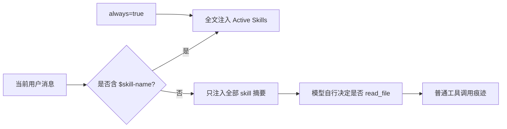

# 技能加载与 WebUI 可见性取证

**日期：** 2026-08-10
**状态：** 已完成源码取证；未提出或实施优化方案
**范围：** 主 agent、subagent、WebUI 的 skill 发现、全文加载和运行时反馈。

## 1. 结论

用户观察与代码机制一致：nanobot 当前采用的是**技能目录 + 懒加载**，不是“根据任务主动选择并加载 skill”的机制。

- 主 agent 每轮能看到全部可用 skill 的名称、描述和 `SKILL.md` 路径；
- 完整 skill 内容只会在两种确定路径中注入：用户本轮显式写 `$skill-name`，或 skill frontmatter 标记 `always=true`；
- 其余情况下，是否用 `read_file` 再打开 `SKILL.md` 完全由模型自行决定；没有 description/意图匹配器、置信度门、选择计划或强制加载规则；
- WebUI 有技能管理页和输入框 `$skill` 补全，但没有 `skill_loaded`、`skill_selected` 或 `skill_failed` 的运行事件与对话内展示；
- 因而系统目前无法量化“某个 skill 被加载/被遵循的频率”。手工读取 skill 时最多表现为普通 `read_file` 工具痕迹，而不是可理解的技能状态。

这解释了“安装了 skill，却很少主动使用、对话中也看不出是否加载”的体验。它是当前设计的直接结果，不是偶发现象。

## 2. 主 agent 事实链

| 事实 | 源码证据 | 含义 |
| --- | --- | --- |
| `SkillsLoader` 枚举工作区和内置 `skills/<name>/SKILL.md`，并构造名称、描述、路径摘要。 | `nanobot/agent/skills.py`：`list_skills()`、`build_skills_summary()` | 模型默认知道“有这些 skill”，但不含完整操作流程。 |
| 显式激活只识别当前用户消息中符合正则的 `$name`，并且必须是可用且未禁用的 skill。 | `nanobot/agent/skills.py`：`get_explicitly_invoked_skills()`；`nanobot/agent/context.py`：`build_messages()` | 自然语言如“帮我查天气”不会被代码自动映射为 `weather`。 |
| 激活 skill 的全文会去 frontmatter 后注入 `# Active Skills`；其余只保留目录。 | `nanobot/agent/context.py`：`build_system_prompt()`；`load_skills_for_context()` | `$weather` 会确定加载；普通天气请求只能依赖模型主动读文件。 |
| 只有 frontmatter `always=true` 可令 skill 每轮全文加载。 | `nanobot/agent/skills.py`：`get_always_skills()` | 当前内置 skill 的 frontmatter未标记 `always=true`；此路径存在，但不是默认行为。 |
| 测试明确断言 memory skill 默认只出现目录，正文不出现。 | `tests/agent/test_context_prompt_cache.py`：`test_memory_skill_is_lazy_loaded_from_skills_index` | 懒加载是经过测试的既有设计，而非遗漏。 |

## 3. 为什么“模型不主动加载”是结构性问题

默认目录给模型的内容本质上是一行描述和路径，并写着“需要时可用 `read_file` 读取”。代码没有再提供以下任何一项：

- 根据用户任务与 skill description 的确定性或模型化候选选择；
- “命中候选后必须先读 skill”的执行约束；
- 已加载 skill 的跨迭代状态；
- skill 读取是否成功、是否被实际采用的记录；
- 反复任务的命中率、漏用率或成本/延迟指标。

此外，部分内置 skill 的细化触发条件主要写在正文的 `When to use` 段，而正文正是激活后才可见。以 `summarize` 为例，frontmatter 只写概括描述，具体 URL/视频/转录触发词在正文。这会形成“模型要先知道该读它，才能看到更明确的该读它的理由”的循环。

`always=true` 不能当作通用补丁：它会把所有指令每轮加入 system prompt，带来上下文成本、无关干扰，并扩大第三方 skill 指令的影响面。

## 4. subagent 事实链

subagent 的专用 system prompt也只包含 `skills_summary`，并提示“通过 `read_file` 拼接路径读取 SKILL.md”。它没有继承父 agent 已加载的 skill 正文，也没有独立的自动选择器。

因此，当前主 agent 即使显式 `$skill`，子 agent 也不会自动得到该 skill 的完整工作流；除非父任务文本明确要求它读取该 skill，或子 agent 自己决定读取。这会降低“把带有专业流程的工作委派出去”时的一致性。

源码证据：`nanobot/agent/subagent.py` 的 `_build_subagent_prompt()` 与 `nanobot/templates/agent/subagent_system.md`。

## 5. WebUI 可见性事实链

| 已有能力 | 证据 | 局限 |
| --- | --- | --- |
| 设置页可查看、安装、禁用 skill。 | `nanobot/webui/skills_api.py`、`webui/src/components/settings/SkillsCatalogSettings.tsx` | 是静态目录管理，不是某一轮实际使用记录。 |
| 编辑器输入 `$` 时可检索并插入可用 skill。 | `webui/src/components/thread/ThreadComposer.tsx` | 是用户手工触发，不是 agent 主动选择。 |
| 对话区显示通用 `tool_hint` / `progress` / file-edit，以及 subagent 生命周期。 | `nanobot/bus/outbound_events.py`、`nanobot/session/webui_turns.py`、`webui/src/hooks/useNanobotStream.ts` | event 模型没有 `skill_*` 类型。 |
| WebSocket 将 `ProgressEvent` 的普通 `tool_events` 传给前端。 | `nanobot/channels/websocket/runtime.py` | 模型手工 `read_file` 时或可见普通文件读取，但没有规范化 skill 名称、原因、结果或成功状态。 |

在 `RuntimeEvent`、`OutboundEvent`、WebSocket dispatcher 和对话流消费者中均未找到 `skill_loaded`、`skill_selected` 或等价事件。`nanobot:skills-changed` 仅用于设置页安装/禁用后的目录刷新，不代表某次 agent 回合使用 skill。

## 6. 已证实、尚不能证实与设计影响

| 问题 | 结论 | 依据/限制 |
| --- | --- | --- |
| WebUI 是否展示“本轮加载了什么 skill”？ | 否。 | 没有运行事件或 UI 消费模型；只有静态设置页和普通工具痕迹。 |
| 主 agent 是否会基于用户意图自动加载相应 skill？ | 否。 | 只有 `$name` 与 `always=true` 是代码确定入口；其余依赖模型临场自觉。 |
| subagent 是否继承父 agent 已加载 skill 正文？ | 否。 | subagent 重新构造自己的目录型 prompt。 |
| 当前真实加载频率是否低？ | 无法从代码量化确认。 | 系统没有 skill 使用遥测；用户观察合理，但需加事件/回放后才能度量。 |
| 是否应把所有 skill 改为 always？ | 不应。 | 会损害上下文预算、相关性和第三方提示安全。 |

后续优化应把三个问题分开讨论，不能只加一个前端标签：

1. **选择：**什么时候哪个 skill 变成候选；
2. **加载：**候选何时必须读全文、何时只保留目录；
3. **可见性：**如何向用户展示选择/加载/失败，同时不暴露完整 prompt 或敏感路径。

## 7. 本次验证留痕

- 主链：已追踪 `AgentLoop._build_initial_messages()` → `ContextBuilder.build_messages()` → `SkillsLoader`；
- 子链：已追踪 `SubagentManager._build_subagent_prompt()` 与 subagent 模板；
- UI 链：已追踪 Runtime/Outbound event 定义、WebSocket 序列化、`useNanobotStream` 和编辑器 `$` 补全；
- 高风险点：确认无自动选择、无 skill 运行事件、正文触发条件对默认模型不可见；
- 未运行自动化测试：本次是只读取证，未改动代码；现有测试已作为证据阅读。

