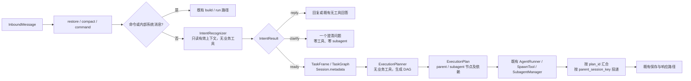

# 意图识别与执行图 V1 基线汇总

**性质：** 定案前汇总稿；统一阅读入口，不新增决策  
**状态：** 历史汇总；已被 ADR-009 的轻量优先基准暂停，不得作为开发依据  
**日期：** 2026-08-10  
**权威来源（历史）：** [意图理解与调度需求](../01_需求/意图理解与调度需求.md)、[执行图最小桥接方案](./执行图最小桥接方案.md)、ADR-001 至 ADR-007；当前以 [ADR-009](../06_决策记录/ADR-009-轻量优先三车道改造基准.md) 为准

## 1. 一句话定义

将 nanobot 的普通自然语言消息从“主模型直接理解并临场决定执行”改为：**先基于有效上下文锚定用户要推进的任务；只有任务可推进时，才由执行规划生成短生命周期工作图，并继续交给既有 Runner 与 subagent 机制运行。**

这是一项增量改造：补足“为什么现在可以执行、为什么要委派”的判断依据，不重写 nanobot 的消息循环、memory、权限或执行器。

## 2. 要解决的问题与不解决的问题

### 要解决

- 上下文没有任务对象时，主 agent 不能自行探索、调用工具或派发 subagent；
- 多个无关候选任务并存时，不能靠“最近提到”或模型偏好擅自选择；
- 用户明确“继续”且上下文存在唯一任务或关系明确的任务图时，应顺畅续办；
- 主 agent 不应临场猜测是否拆分 subagent；委派必须能追溯至工作依赖、范围和验收；
- subagent 结果必须只归属于父会话和当前执行计划，不能串入其他会话或其他任务。

### 明确不解决

- 不按“研究/开发/写作”等类别配置固定 subagent 角色；
- 不新建能力权限、账号授权、确认或安全策略；
- 不重写 `AgentRunner`、memory、Session 历史、Dream、工具注册、取消或 WebUI 协议；
- 不在 V1 决定提示词细节、模型供应商、成本阈值、完整任务 UI 或工作树隔离。

## 3. 已确认的行为规则

| 上下文情况 | 必须行为 | 禁止行为 |
| --- | --- | --- |
| 无可解析任务对象、活动任务或任务图 | 只问一个聚焦澄清问题 | 工具调用、网络/历史探索、subagent、计划生成 |
| 一个唯一未完成任务帧 | 解析为续办并进入规划 | 因任务是邮件等外部动作而额外默认确认 |
| 关系明确任务图的 ready 前沿 | 按声明关系进入规划 | 将多个无关 ready 点默认并行或默认挑一个 |
| 多个无关候选或关系不明 | 澄清对象、优先级或关系 | 以模型偏好、成本或最近上下文自动选择 |
| 任务已明确、既有工具具备权限 | 直接执行 | 意图层重复解释或扩张权限语义 |

“任务锚定”只说明用户要做什么；真正的工具、账号、策略、确认与安全拒绝仍完全由既有运行时决定。

## 4. V1 总体链路



新增阶段的位置是：

```text
restore → compact → command → interpret → build → plan → run → save → respond
```

其中 `interpret` 与 `plan` 是新增的窄插点；`build`、`run`、`save` 和 `respond` 仍由现有机制承担。

## 5. 三层状态，三种职责

| 层 | 对象 | 生命周期 | 唯一职责 | 不承担的职责 |
| --- | --- | --- | --- | --- |
| 跨轮任务层 | `TaskFrame` / `TaskGraph` | 跨用户轮次 | 保存已明确任务、约束、验收与关系前沿 | 工具顺序、subagent 数量、运行期并发 |
| 本轮理解层 | `IntentResult` | 当前轮 | 理解消息行为、锚定、范围、证据和澄清/可推进分支 | 执行者分配、工具选择、权限判断 |
| 本轮执行层 | `ExecutionPlan` | 当前执行切片 | 用 DAG 组织工作节点、依赖、执行者与汇合 | 长期任务事实、跨会话路由、权限规则 |

`TaskFrame` 使用现有 `Session.metadata` 的紧凑、版本化数据；不写模型长推理、原始 subagent 输出或完整会话副本。`ExecutionPlan` 默认只驻留当前切片，进程终止或上下文实质改变后由任务帧重新规划。

## 6. 意图识别的 V1 设计

### 输入范围

仅允许使用有效上下文：当前用户消息、直接回复/附件、待澄清问题的回答、唯一活动任务帧、已确认任务图及受限会话摘要。禁止为了寻找目标而无界翻查历史、网络、文件或启动 subagent。

### 处理方式

采用“确定性候选提取 + 无工具结构化裁决”：

- 显式任务 ID、直接引用和唯一活动任务可由确定性逻辑直接锚定；
- 省略表达、修正、关系判别等语义问题，才使用当前会话同一 LLM runtime 的无工具结构化调用；
- 输出必须通过 schema 与证据校验；失败时只澄清，不能恢复为主模型自由执行。

### 最小输出

```text
IntentResult = {
  intent_id, disposition, message_kind, anchor,
  task_ids, goal, scope, constraints, acceptance,
  evidence_refs, clarification_question?
}
```

`disposition` 仅为 `reply | clarify | ready`。意图层不得输出“请开两个 explorer”之类的执行建议。

## 7. 执行规划与 subagent 机制

当且仅当 `IntentResult.disposition == ready`，规划器使用当前 runtime 的无业务工具调用生成受校验 DAG：

```text
节点 = 目标 + 输入 + 交付物 + 验收 + 执行者(parent/subagent)
边   = 必须完成后才能开始的依赖
```

| DAG 形态 | 运行方式 |
| --- | --- |
| 单一 `parent` 节点 | 原 `AgentRunner` 工具循环执行 |
| 依赖链上的 `subagent` 节点 | 复用 `spawn(wait=true)` / `run_inline` 串行取得结果 |
| 多个无依赖 `subagent` 节点 | 复用后台 `spawn(wait=false)`；实际并发受现有配置上限约束 |
| 独立 `parent` 与 `subagent` 节点，随后汇合 | 父 Runner 继续工作，按当前 `plan_id` 等待并整合所需结果 |

V1 不允许计划仅存在于 prompt 中：

1. `SpawnTool` 必须绑定已登记、依赖满足的 `plan_node_id`；
2. Runner 在必需节点未启动或未汇合时不能把任务伪装为完成；
3. 写入共享资源、同一文件或外部目标不明确时默认串行；只有只读或明确互斥输出路径的节点才可并行；
4. 计划结构无效、容量不足或无法安全判定写入冲突时，降级为单一 `parent` 节点，绝不自由委派。

## 8. subagent 结果归属与汇合

每个后台任务登记：

```text
task_id → { parent_session_key, plan_id, plan_node_id }
```

结果公告必须保留父会话有效键；在进入 pending queue、会话历史、模型上下文和用户输出前，再以任务登记做一次所有权校验。

- `parent_session_key` 不一致、为空、task 未知或归属缺失：隔离、审计、零注入；
- 不同有效 session key 的结果绝不互相可见；
- 同一会话内，结果也只能满足同一 `plan_id` 的完成门，避免旧后台任务干扰新任务；
- 显式统一会话会把来源合并为同一有效 session；若未来要共享记忆但隔离聊天线程结果，需单独引入 `conversation_scope_id`。

## 9. 与现有 nanobot 的兼容边界

| 既有能力 | V1 处理 |
| --- | --- |
| 消息循环 | 保留；仅在 `command` 后、`build` 前插入意图阶段，并在 `build` 后、`run` 前插入计划阶段。 |
| `AgentRunner` | 保留为唯一工具循环；允许添加默认无效的通用续办回调，不感知计划业务对象。 |
| Session / memory / Dream / provider state | 保留格式与语义；仅在 `Session.metadata` 添加新命名空间下的紧凑任务帧。 |
| 权限、确认与安全 | 原样复用；意图与规划不放宽、替代或新增确认门。 |
| `SubagentManager` | 保留生命周期、取消、结果预算、状态事件和工具隔离；仅补任务所有权与计划映射。 |
| WebUI | 既有协议不动；首版只需结构化日志，执行图展示不是前提。 |

新增能力以默认关闭 feature flag 接入。关闭时必须完全执行当前路径：零新增模型调用、零新增任务状态写入、零新增工具或 subagent 行为。

## 10. 验收与发布门

### 行为回放

- 无对象的“帮我处理一下”：只澄清，零工具、零 subagent；
- 两个无关事项的“继续”：请求选择；
- 唯一明确任务的“继续”：续办且保留既有权限语义；
- 关系明确多 ready 点：根据关系生成可复核执行图；
- 子 agent 节点可回溯到意图、范围、交付物与验收；
- 默认并发上限为 1 时，不承诺双子并行；
- 子 agent 失败、取消、规划失败或迭代耗尽时，不伪造完成。

### 隔离与兼容回归

- 会话 A 的结果不会进入有效会话键 B 的 pending queue、历史、模型请求或 outbound；
- 不同 `plan_id` 的同会话后台结果不能互相满足完成门；
- feature flag 关闭时，新增模块调用次数为零，现有 Runner、memory、/goal、工具、subagent 和 WebUI 回归保持通过；
- feature flag 开启后，不改变 Session 历史、Dream memory 或 provider 会话状态的既有数据格式。

## 11. 尚未定案但不阻塞架构基线的事项

| 事项 | 当前处理 | 何时决定 |
| --- | --- | --- |
| 意图/计划调用成本和延迟阈值 | 先采集回放数据，不预设数字 | 切片 A、B 评测后 |
| 计划图的用户可见 UI | 首版仅保留结构化日志 | 有真实使用反馈后 |
| `conversation_scope_id` | 仅当“共享记忆但隔离线程结果”成为需求时引入 | 出现该产品需求时 |
| 更细粒度资源声明/写入租约 | V1 保守串行 | 并行收益有证据且现有规则不足时 |

## 12. 文档地位与追溯

本文件只汇总，不改变下列文件的状态或决策效力：

- [需求 v0.6](../01_需求/意图理解与调度需求.md)：产品行为与验收标准；
- [执行图最小桥接方案 v0.2](./执行图最小桥接方案.md)：技术方案草案；
- [ADR-001](../06_决策记录/ADR-001-上下文优先的任务锚定.md)：上下文优先准入；
- [ADR-002](../06_决策记录/ADR-002-任务准入与状态迁移架构.md)：结构化状态与准入；
- [ADR-003](../06_决策记录/ADR-003-以能力权限决定确认门.md)：意图授权与既有能力权限；
- [ADR-004](../06_决策记录/ADR-004-意图层前置且复用既有运行机制.md)：增量接入边界；
- [ADR-005](../06_决策记录/ADR-005-意图识别与执行规划分层.md)：语义与执行职责分层；
- [ADR-006](../06_决策记录/ADR-006-subagent结果会话归属隔离.md)：结果会话归属隔离；
- [ADR-007](../06_决策记录/ADR-007-第一版实施边界与运行时兼容.md)：默认关闭与运行时兼容门。
