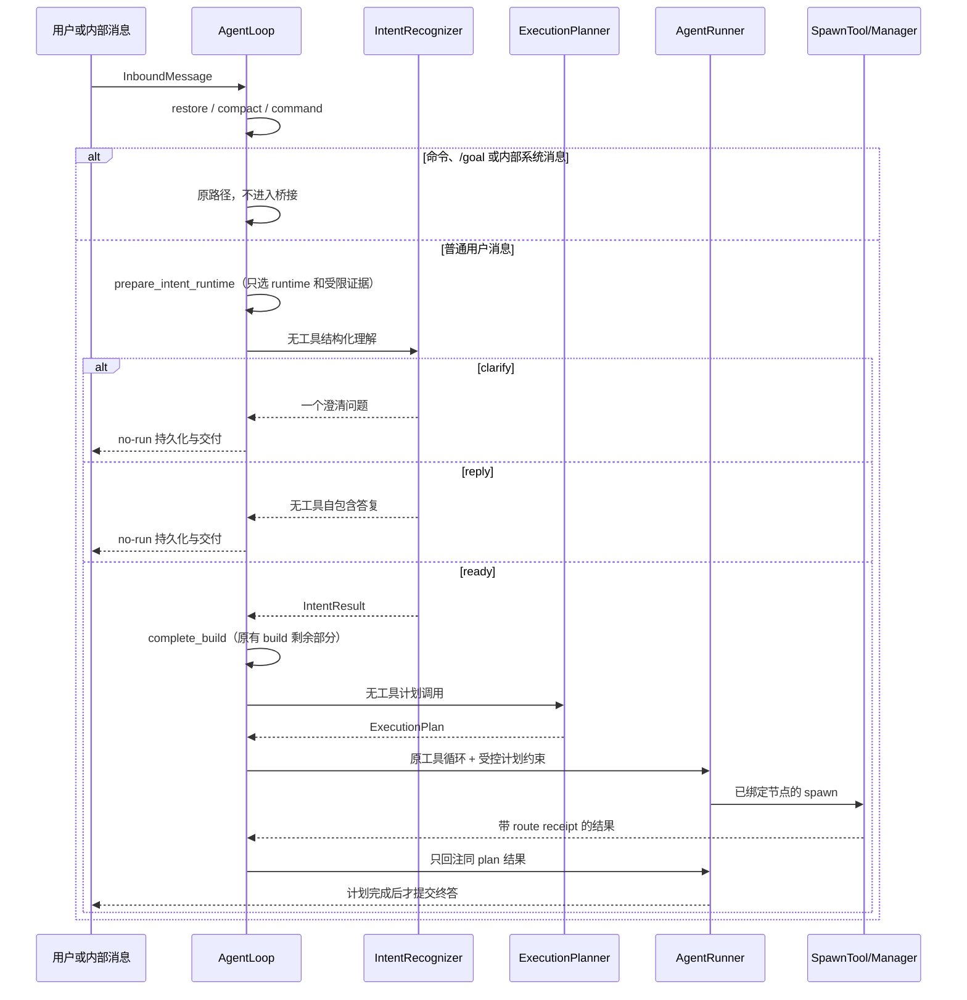
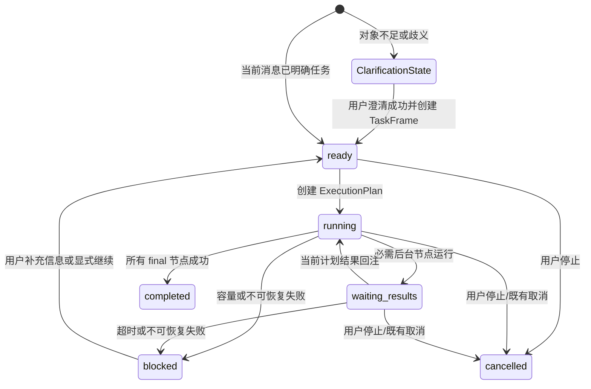

# 执行图最小桥接方案

**版本：** v0.3（历史桥接草案）
**状态：** 已被 ADR-009 的轻量优先基准暂停；不得据此进入隔离开发
**日期：** 2026-08-10
**关联：** 历史关联 FR-002 至 FR-011、AC-001 至 AC-011；ADR-004 至 ADR-008；[ADR-009](../06_决策记录/ADR-009-轻量优先三车道改造基准.md)；[基线冲突审查](../02_调研/桥接方案与当前基线冲突审查.md)

> **状态说明（2026-08-10）**：本文假定每个 `ready` 回合均经过独立意图与计划调用，并倾向为所有可推进任务建立执行图；这与已确认的“快速车道零侵入、复杂任务才编排”基准冲突。保留本文作为历史正确性材料，其中会话隔离、计划隔离和终答提交约束仍可复用；在完成输入契约、skill 选择与成本回放的重设计前，不得用本文安排开发。

## 1. 结论与边界

nanobot 不需要第二套调度器，也不需要固定 subagent 角色池。第一版只增加一座受控桥梁：先判断当前上下文能否解释用户要推进的事，再为已经确认的工作生成一次短生命周期执行图；真实工具调用、权限、确认、子任务执行、会话与 memory 仍由现有机制负责。

桥梁必须满足四条不可违反的规则：

1. 无对象或多个无关对象时，零业务工具、零 subagent，只问一个澄清问题；
2. subagent 结果是创建它的有效会话专属数据，绝不跨会话；
3. 一个计划的结果绝不成为另一个计划的输入；
4. 计划要求的工作未完成时，不能向用户显示“已完成”的最终答复。

**明确不做：**不重写 `AgentRunner`、`SubagentManager`、ToolRegistry、memory、provider state、`/goal`、取消语义或 WebUI 事件协议；不新建常驻调度服务、数据库、消息队列或新的权限体系。

## 2. 已核对的基线与最小插点

| 基线事实 | 最小改动 |
| --- | --- |
| `AgentLoop` 当前串联 `restore → compact → command → build → run → save → respond`。 | 在 `command` 后增加受限准备和意图判断；只有 `ready` 才进入原业务 build/run。 |
| runtime 在 `_build_turn()` 才选择，build 还含 memory、provider state 与用户消息早期持久化。 | 把 build 内部拆为无副作用的 `prepare_intent_runtime` 和原有的 `complete_build`，不复制会话写入逻辑。 |
| pending queue 只按有效 session key 存在。 | 在入队前增加计划结果路由适配；普通用户消息仍按原队列走。 |
| subagent 结束后立即清理运行登记。 | 为计划模式新增 TTL 结果路由收据，不依赖已清理的运行表做消费校验。 |
| Runner 流式 token 立即外发。 | 仅计划模式且必需节点未结束时，暂存候选终答；Runner 仍不理解任务图。 |

## 3. 组件边界与数据流



### 3.1 责任划分

| 组件 | 负责 | 明确不负责 |
| --- | --- | --- |
| `IntentRecognizer` | 解释用户表达、锚定对象/任务、决定 `reply`、`clarify` 或 `ready` | 工具选择、权限判断、任务拆分、spawn。 |
| `ExecutionPlanner` | 为一个 `ready` 意图输出有依赖和执行者的 DAG | 运行工具、占用并发、跨会话路由。 |
| `AgentLoop` 中的桥接适配器 | 计划状态、结果路由、完成门、no-run 收尾 | 重写 Runner 或管理子任务执行。 |
| `AgentRunner` | 既有 LLM/工具循环；接受通用的“是否继续”和“是否提交终答”回调 | 知道 `TaskFrame`、`plan_id` 或 subagent 生命周期。 |
| `SubagentManager` | 既有子任务执行、取消、状态和公告 | 计划调度、会话猜测、任务图推理。 |

## 4. 精确定义的数据契约

所有新增持久化数据置于 `Session.metadata["execution_bridge_v1"]` 命名空间，schema version 为 `1`，序列化后最大 32 KiB。解析失败、版本不支持或超限时，保留原 Session 数据不动，桥接本轮 fail-closed 为一次澄清；禁止根据损坏状态猜测并执行。

### 4.1 `TaskFrame`：跨轮的唯一任务事实

```text
TaskFrame = {
  id, goal, object_refs, constraints, acceptance,
  status, source_turn_ids, active_plan_id?,
  completed_evidence_refs, updated_at
}
```

`TaskFrame` 只记录用户已明确确认的目标、对象、约束和已验证的节点摘要；不记录模型思维链、完整聊天记录、原始子任务结果或 provider state。`object_refs` 只能引用当前消息、直接附件/回复、已有任务帧或已确认任务图中的证据。

### 4.2 `ClarificationState`：未锚定信息的短暂占位

无对象或歧义不是任务。此时不创建可执行 `TaskFrame`，仅保存 `{question, candidate_refs?, source_turn_id, expires_after_next_user_turn}`。用户下一次实质回答后立即消费或失效，绝不被“继续”当作任务恢复。

### 4.3 `IntentResult`：无工具的语义输出

```text
IntentResult = {
  version, intent_id,
  disposition: reply | clarify | ready,
  message_kind: question | new_task | continue | amend | clarification_answer,
  anchor: none | unique_task | task_graph | ambiguous,
  task_ids, goal?, scope?, constraints?, acceptance?, evidence_refs,
  clarification_question?, direct_reply?
}
```

- `clarify` 只能带一个问题，且不调用 Planner 或业务工具；
- `reply` 仅用于不依赖外部事实、工具或任务续办的自包含回答，必须带 `direct_reply`；任何需要检索、修改、发送、创建或后台执行的请求均不是 `reply`；
- `ready` 才可创建/更新 `TaskFrame`、进入 Planner；
- 输出必须严格 schema 校验，字段不合法或证据越界即降级为 `clarify`，不自由执行。

### 4.4 `ExecutionPlan` 与 `PlanReceipt`

```text
ExecutionPlan = {
  version, plan_id, task_frame_id, intent_id, nodes,
  final_node_ids, status: active | completed | blocked | cancelled,
  created_at
}

PlanNode = {
  id, objective, bounded_inputs, deliverable, acceptance,
  executor: parent | subagent, depends_on, write_scope,
  status: pending | running | succeeded | failed | blocked_capacity | cancelled,
  parent_fallback_allowed
}

PlanReceipt = { plan_id, task_frame_id, terminal_status, completed_node_refs }
```

`ExecutionPlan` 只在当前执行切片存活；`PlanReceipt` 与完成节点的受限摘要进入 TaskFrame，用于“继续”或重规划。重规划必定新建 `plan_id`，旧计划未消费的结果不得自动满足新计划。

### 4.5 `ResultRouteReceipt`：子任务结果的所有权收据

```text
ResultRouteReceipt = {
  task_id, parent_session_key, plan_id, node_id,
  task_frame_id, expires_at, consumed_at?
}
```

计划模式新增一个仅供桥接调用的、向后兼容的启动入口：`spawn_planned(...) -> SpawnStart{task_id, display_message}`。它在 `SubagentManager` 的同一临界区内依次分配 `task_id`、写入 `ResultRouteReceipt`、登记运行任务，再允许后台 coroutine 开始；不能先调用现有仅返回文本的 `spawn()`，再事后补收据。旧 `spawn()` 保持不变。

公告 envelope 必带同样的 `task_id`、`parent_session_key`、`plan_id`、`node_id`，且 `session_key_override == parent_session_key`。收据仅在结果成功消费、明确取消后的安全收尾或 TTL 到期后删除。计划模式中父有效会话键缺失即拒绝启动，绝不 fallback 到 channel/chat。

## 5. 运行规则

### 5.1 正确的回合顺序

```text
restore → compact → command
  → prepare_intent_runtime → interpret
  → [clarify | reply：no-run finalize]
  → [ready：complete_build → plan → run → save → respond]
```

`prepare_intent_runtime` 只选择当前 session 的 runtime，并读取当前消息、直接附件/回复、紧凑 TaskFrame/ClarificationState 与受限摘要。它不得触发 memory consolidation、工具上下文构建、provider state 暂存、用户消息写入或任何业务工具。

`no-run finalize` 是从既有保存/交付路径中抽出的统一收尾：准确持久化本轮用户消息和澄清/直答，但不把意图调用写成普通 assistant 对话、也不修改 provider state。这样澄清不会“失忆”，又不会在没有资格执行时启动业务运行机制。

命令、`/goal`、内部 system 消息优先于桥接，完整保留原路由。自然语言“继续”只有在唯一活动 TaskFrame 或关系明确任务图中才成为 `ready`；活跃 `/goal` 不被普通 TaskFrame 改写。

### 5.2 受限模型调用与输入安全

意图和计划分别使用当前 session 的同一 runtime，但均为无业务工具、无 provider-state 写入的结构化调用。输入中的用户文字、附件摘要、历史摘录均以数据块传入，不能覆盖系统指令；只允许输出白名单 schema 与已给定的 evidence refs。结构化解析失败：

- 意图失败 → 澄清，不执行；
- 计划失败 → 一个 `parent` 节点，`planning_reason=fallback`，禁止自由 spawn。

这保留用户已明确任务的执行授权；现有工具的账号、策略和确认判断仍在原路径处理。

### 5.3 计划、并行与容量

Planner 只能将输入/交付物/验收明确的节点分给 subagent。并行的充分条件是：节点无依赖，且均只读或 `write_scope` 明确互斥；否则串行。Planner 使用当时真实并发上限和运行数，但这只是快照。

真实 `spawn` 若发现容量已被其他会话占用，节点立即标为 `blocked_capacity`，不进行模型驱动的反复重试。若该节点的 `parent_fallback_allowed=true` 且不存在写入冲突，桥接将它一次性改由父 agent 完成；否则将计划置为 `blocked`，由父 agent 基于真实失败事实向用户说明未完成部分。第一版不引入跨会话排队或容量预留服务。

### 5.4 结果投递、精确汇合与延后结果

任何 `subagent_result` 在进入 pending queue、Session 历史、模型上下文和用户输出**之前**，按以下顺序校验：

1. 找到未过期 `ResultRouteReceipt`；未知 task、空归属或过期收据隔离并审计；
2. task id、父有效 session key、`plan_id`、`node_id` 与公告 envelope 逐项相等；
3. 消息的有效 session key 必须等于收据父会话键；否则隔离；
4. 仅当该 session 当前活跃回合的 `plan_id` 相等时，才投递当前 pending queue。

合法但不同计划、或父回合已结束的结果，不进入任何活跃模型上下文；适配器将其压缩为完成证据写入原 `TaskFrame`，标记对应 PlanReceipt，并放入按 `{session_key, plan_id}` 索引的 deferred-result lane。它不自主发出 assistant 回复。用户下次“继续”或针对该 TaskFrame 的请求会读取这些完成证据并重规划/整合。

结果成功消费一次后标记 `consumed_at` 并删除收据；重复公告按已消费隔离。由此同时保证跨会话隔离、跨计划隔离与 exactly-once 模型回注。

### 5.5 最终答复提交门

当 active plan 尚有必需节点为 `pending`、`running` 或可继续等待的状态时，桥接包装 turn hook：候选最终文本只暂存，不外发 token；工具状态等非终答进度保持原样。节点完成后，当前 plan 的结果才可回注，Runner 继续生成整合答复。

计划进入 `completed` 时才提交最后一个候选终答。进入 `blocked`、`failed`、`cancelled`、迭代上限或既有超时时，允许提交明确标注未完成原因的答复；禁止把未完成描述为完成。feature flag 关闭或没有 active plan 时，流式回调完全不包装，保持原行为。

### 5.6 状态机、停止与重规划



`ClarificationState` 只在下一次实质用户输入前存在，不能被“继续”续办。用户修改目标、补充改变范围的新事实、节点失败需要替代路径或从 deferred lane 恢复时，当前 plan 先终结并写 `PlanReceipt`，再创建新 plan。旧 `plan_id` 的未消费结果只能作为待核验的证据，不能绕过新的依赖或验收条件。现有 `/stop` 和取消路径优先；只更新桥接自身状态，不改变 `/goal` 语义。

## 6. 故障、降级、数据与可观测性

| 情况 | 处理 | 用户可见行为 |
| --- | --- | --- |
| 无对象/歧义/意图 schema 无效 | no-run 澄清 | 一个聚焦问题，零工具/委派。 |
| 计划 schema 无效 | 单父节点降级 | 在既有执行路径完成已锚定任务。 |
| 容量竞争 | 一次父回退或 `blocked` | 不承诺虚假并行、不重试风暴。 |
| 子任务失败或取消 | 更新节点，完成门阻止伪完成 | 整合失败事实或明确未完成。 |
| 路由校验失败/重复公告 | 隔离，安全审计 | 无历史写入、无模型回注、无用户输出。 |
| 进程终止 | 临时 plan/内存收据失效；TaskFrame/PlanReceipt 保留 | 后续“继续”按已保存证据重新规划，不恢复幽灵子任务。 |

新增结构化日志不写原始任务内容、附件或模型提示，仅记录 `session_key` 的安全散列、`task_frame_id`、`plan_id`、`node_id`、事件类型、结果与耗时。第一版记录：intent 分支、计划降级、route 隔离、deferred、完成门阻塞、容量回退和终态。指标阈值与告警渠道尚无运行基线，列为实施后灰度测量项，不在本方案虚构 SLO。

## 7. 实施切片与不可回归门

1. **A：兼容壳与状态契约。** feature flag 默认关闭；metadata codec、TaskFrame/ClarificationState、runtime 预备和 no-run 收尾。关闭开关时新增模块零调用。
2. **B：意图与计划。** 无工具严格 schema、直答/澄清/ready 分支、单父节点降级；先只记录计划，回放验证。
3. **C：绑定 spawn 与结果隔离。** `plan_node_id`、ResultRouteReceipt、入队前校验、deferred lane、跨会话/跨计划测试。
4. **D：汇合与终答门。** 通用 Runner 回调、流式缓冲、容量回退、失败/取消/重规划回归。
5. **E：隔离灰度。** 只在开发 worktree 的独立会话启用；通过回放与现有回归后，才可讨论用户运行实例的显式启用。

实施顺序不能跳过：C 和 D 未通过前，不把计划模式开放给真实会话。

## 8. 进入开发的判定

本方案不再具备安排隔离开发的条件。后续方案必须先满足 ADR-009 的快速车道、输入契约、skill 候选加载和成本回放要求；可复用的会话隔离、计划隔离、结果收据与终答提交约束，应在新方案中按复杂任务范围重新引用。

重新评审条件：需要改动既有 memory/权限/`/goal` 语义；无法以窄适配实现 route receipt 或终答门；feature flag 关闭仍发生新增调用/写入；或回放显示计划模式不能稳定满足本方案的隔离与终答规则。
