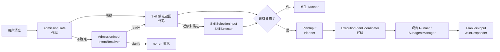

# 模型输入输出契约

**版本：** v0.1（待评审）

**状态：** 技术设计提案；不得据此直接进入开发

**日期：** 2026-08-10

**关联：** [ADR-009：轻量优先三车道改造基准](../06_决策记录/ADR-009-轻量优先三车道改造基准.md)、[轻量优先执行规划技术设计](./轻量优先执行规划技术设计.md)

## 1. 目的与结论

本文件定义 LLM 在改造后究竟看什么、不能看什么、能输出什么，以及代码在何处接管决定权。

结论：只有四类**可选的、无工具的结构化模型调用**。它们不替代现有主 Agent 的执行模型调用；快速车道不触发其中任何一个。另有一个 `NodeExecutionContext`，但它是协调器与 Runner 之间的代码对象，不是第五次 LLM 调用。



图中 `PlanInput` 只在编排车道出现，且必定早于任何计划节点执行；`PlanJoinInput` 只在需要汇合多个节点结果时出现。单步骤任务路径是 `A → B → D → F → G`，与现在一样只有原 Runner 的模型调用。

## 2. 现有代码事实与由此产生的约束

| 事实 | 源码证据 | 契约约束 |
| --- | --- | --- |
| `LLMProvider.chat()` 只提供 messages、tools、model、generation 参数，没有统一 response schema 参数。 | `nanobot/providers/base.py` | 结构化调用必须以 JSON-only prompt + 严格本地解析实现，不能依赖某一供应商特性。 |
| `AgentLoop._build_turn()` 同时选择 runtime、整理历史、解析 Runtime Context、暂存 provider state 并早持久化用户消息。 | `nanobot/agent/loop.py` | 结构化调用不能借用完整 `build`；必须有只选择 runtime、构造有限快照的窄准备步骤。 |
| `RequestContext.attributes` 已可携带本轮只读属性。 | `nanobot/agent/tools/context.py` | 经过验证的车道与节点快照可下传，但不能成为权限来源。 |
| Runtime Context 会附到当前 user 内容并在模型历史中保留。 | `nanobot/runtime_context.py` | 稳定 TaskFrame 摘要可作为 Runtime Context；一次性节点指令不得放入这里。 |
| `ContextBuilder` 每次生成 system prompt，普通系统提示不会写回 Session。 | `nanobot/agent/context.py` | `NodeExecutionContext` 应成为临时 system extension，避免执行指令污染用户历史。 |

## 3. 所有结构化调用的共同契约

### 3.1 调用方式

新增一个内部 `StructuredModelCall`，仅做以下通用工作：构建两条消息（固定 system 契约、JSON 编码 user 数据）、使用当前 `LLMRuntime` 调用 `provider.chat_with_retry()`、禁用 tools、严格解析并验证输出、返回可观测结果。

它不使用 `AgentRunner`，不创建 provider conversation state，不流式输出，不写 session history，不执行工具，不把模型回复直接展示给用户。这样可以避免结构化判断污染原有多轮工具会话。

当前 provider 基类不保证原生 JSON mode，因此第一版要求：

1. system prompt 要求“只返回一个 JSON object，不含 Markdown”；
2. 使用标准 `json.loads`，随后使用严格 schema 校验（未知字段拒绝）；
3. 不使用 JSON 修复来放宽可执行字段；
4. 返回 tool call、空内容、非 object、schema 失败或超出字段预算，一律视为该调用失败；
5. 每类调用定义自己的安全降级，绝不让失败回退为自由工具调用或自由委派。

模型参数、超时、重试次数和输出 token 上限必须来自新增配置，具体默认值待真实回放确定；不得散落硬编码常数。

### 3.2 共同输入信封

每份输入均使用下列代码生成信封，字段值 JSON 编码并被声明为数据而非指令：

```text
ContractEnvelope {
  schema_version: "orchestration.v1",
  contract: "admission" | "skill_selection" | "plan" | "plan_join",
  turn_id: opaque string,
  locale: optional string,
  data: object
}
```

`session_key`、用户身份、账号凭据、绝对工作区路径、provider 私有状态、原始完整 history、memory 正文和工具/MCP schema 不进入任何结构化模型输入。证据只通过受限 `EvidenceRef` 传递：

```text
EvidenceRef { id, source, summary_or_json_value, trust: user_explicit | session_state }
```

`source` 仅允许 `current_message`、`webui_quote`、`attachment_ref`、`clarification_state`、`task_frame`、`task_graph`。来自当前用户、附件或引用的文本即使由可信通道转发，仍视作**内容数据**，不能覆盖 system 契约。

### 3.3 共同输出与审计

所有输出都只能引用输入中已存在的 ID；代码生成 `plan_id`、`task_id`、`node_id`，模型不能生成或覆盖这些身份字段。审计事件仅记录 contract 名称、结果类型、schema 是否通过、耗时、输入/输出 token、候选数量和降级原因；不记录用户原文、skill 正文、结果正文、密钥或 provider state。

## 4. Contract A：AdmissionInput

### 4.1 调用时机与职责

`AdmissionGate` 先做确定性判断。只有“指代不明、多个无关候选、正在回答澄清、或明显缺对象但无法确认是不是自包含问答”才调用 IntentResolver；清晰问答、清晰行动、唯一待续办任务、命令和内部消息不调用。

IntentResolver 的职责仅是从已有候选中确认是否已经具备可推进对象，或形成一个聚焦澄清问题。它不回答业务问题，不规划，不选 skill，不选择工具，不判断权限。

### 4.2 输入白名单

```text
AdmissionInput.data {
  current: {
    text: bounded user text,
    attachment_refs: [{ id, media_kind, display_name? }],
    explicit_reference_ids: [EvidenceRef.id]
  },
  awaiting_clarification?: {
    id, partial_goal, known_fields, missing_fields, candidate_ids
  },
  candidate_tasks: [{
    id, status, goal, scope_summary, acceptance_summary, relation_summary
  }],
  admissible_evidence: [EvidenceRef]
}
```

`candidate_tasks` 只来自版本化 session metadata 中的 TaskFrame / TaskGraph，不能从“模型觉得历史里像个任务”的文本推断。附件只给引用，不给文件正文；Runner 仍按既有多模态或文件工具路径处理实际内容。

### 4.3 输出与代码校验

```text
AdmissionResult {
  disposition: "ready" | "clarify",
  anchor_id?: "current_message" | known task / clarification ID,
  resolved_fields?: { target?, scope?, acceptance? },
  missing_fields: ["target" | "scope" | "choice" | "acceptance"],
  clarification_question?: string,
  evidence_ids: [EvidenceRef.id]
}
```

校验规则：`ready` 必须有允许的 `anchor_id`、至少一个关联证据、且 `missing_fields` 为空；`clarify` 必须只问一个问题并指出至少一个缺失字段。`resolved_fields` 只能更新正在等待的澄清态的白名单字段，不能创建未引用的新任务。

失败降级：不执行工具、不运行 Planner、不派发 subagent，使用代码模板提出一个最小澄清问题；由 `finish_non_execution_turn` 持久化用户输入、澄清态和用户可见问题。

## 5. Contract B：SkillSelectionInput

### 5.1 调用时机与职责

先用本地召回从 active skill 描述中寻找候选：无候选不调用；高置信唯一候选直接绑定；只有多个候选难分且它们会改变工作流时才调用 SkillSelector。它不是“让 LLM 自己去翻 skill 目录”。

### 5.2 输入白名单

```text
SkillSelectionInput.data {
  task: { goal, scope, constraints, anchor_evidence_ids },
  current_request: bounded user text,
  explicit_skill_names: [string],
  candidates: [{
    name, description, source, optional_tags, optional_triggers,
    availability: "available"
  }],
  selection_budget: { max_count, max_context_tokens }
}
```

skill 正文、绝对路径、缺失环境变量名称、工具 schema 和 MCP 列表不传入。`always` 与用户显式 `$skill` 已在代码侧处理；选择器不能移除它们。

### 5.3 输出与代码校验

```text
SkillSelectionResult {
  decision: "bind" | "none",
  selected_names: [candidate.name],
  reason_codes: ["workflow_match" | "explicit_request" | "domain_match"]
}
```

名称必须是 candidate 集合的子集，数量和正文 token 必须不超过 `selection_budget`。输出不得包含 skill 内容、工具建议或自由解释。校验成功后才由 `SkillsLoader.load_skills_for_context()` 读取对应正文，并把“已应用 skill 名称”作为可选 UI 事件。

失败降级：不绑定自动 skill，保留现有 skills summary、`always` 和 `$skill` 行为，继续原 Runner。此降级牺牲主动性但不影响任务可完成性。

## 6. Contract C：PlanInput

### 6.1 调用时机与职责

只有编排资格已由代码确认时才调用 Planner：对象和验收成立，且有多交付物、明确依赖、可验证并行收益、用户明确后台/分工要求，或关系明确的跨回合 ready 前沿。单步骤任务不调用。

Planner 只确定可审核的工作结构；不调用工具、不执行操作、不分配权限、不从工具目录选择能力。代码随后验证结构并保留最后的启动权。

### 6.2 输入白名单

```text
PlanInput.data {
  task: { id, goal, scope, constraints, acceptance, evidence_ids },
  ready_frontier?: [{ id, goal, acceptance, known_dependencies }],
  selected_skills: [{ name, description }],
  execution_facts: {
    subagent_enabled: boolean,
    max_concurrent_subagents: positive integer,
    background_requested: boolean,
    declared_resource_claims: [{ resource, mode: "read" | "write" }]
  }
}
```

这里的并发容量只是规划提示，不是启动授权；协调器在真正 spawn 前重新检查。Planner 不看完整 tool/MCP schema，因为“如何用能力完成节点”是既有 Runner 的职责，而不是任务拆分的前提。

### 6.3 输出与代码校验

```text
PlanResult {
  mode: "parent_only" | "orchestrated",
  delivery_mode?: "join_now" | "background_notify",
  nodes?: [{
    local_key, actor: "parent" | "subagent", goal,
    input_evidence_ids, deliverable, acceptance,
    depends_on: [local_key], resource_claims
  }]
}
```

代码生成真正 `plan_id/node_id`，并验证：无环、所有依赖和证据存在、每个 subagent 有非空交付物与验收、节点和并发在配置上限内、共享写入未冲突、后台模式是用户明确要求。验证通过才创建 `ExecutionPlan`；否则以 `parent_only` 降级并记录原因。Planner 不能通过输出把单任务伪装成多节点来获得 subagent。

## 7. Contract D：PlanJoinInput

### 7.1 调用时机与职责

`ExecutionPlanCoordinator` 已经确定：结果属于当前 `{session_key, plan_id, node_id, task_id}`，所有必需节点已终态，且没有被取消或替换，才调用 JoinResponder。它负责语义整合，不再执行工作。

它采用无工具的单次模型调用，而不是把后台结果作为自由内部消息再扔给正常 Runner。这样模型无法借合龙机会重复工具操作、自由 spawn 或越过计划追加分支。

### 7.2 输入白名单

```text
PlanJoinInput.data {
  task: { goal, scope, acceptance, user_requested_delivery },
  plan: { id, delivery_mode, required_node_ids },
  node_outcomes: [{
    node_id, actor, status: "completed" | "failed" | "cancelled" | "blocked",
    deliverable, acceptance, result_excerpt_or_artifact_ref
  }],
  user_visible_context: { preferred_language?, prior_visible_progress? }
}
```

结果正文按统一预算截断或以 artifact 摘要引用表示；未消费的其他计划结果、完整父历史、工具调用原文、凭据、route receipt 内部字段不输入。JoinResponder 不能读取 artifact 文件，也不能执行工具。

### 7.3 输出与代码校验

```text
PlanJoinResult {
  completion: "complete" | "incomplete",
  final_answer: string,
  referenced_node_ids: [required node_id]
}
```

`complete` 仅当全部 required nodes 的代码状态都是 `completed` 才允许；否则强制改为 `incomplete` 或拒绝结果。输出不能带计划修改、工具调用、任务创建或外部动作指令。若语义上发现矛盾，第一版以 `incomplete` 如实说明；用户下一轮“继续”后再走新的准入和规划，禁止 JoinResponder 自主重规划。

失败降级：协调器用代码生成的节点状态和有限结果摘要输出真实未完成说明，不能沿用 parent 的候选“已完成”文本。

## 8. 非模型内部契约：NodeExecutionContext

`NodeExecutionContext` 是协调器构造给每个 parent/subagent 节点的不可变代码对象：

```text
{ plan_id, node_id, task_frame_id?, goal, input_evidence,
  deliverable, acceptance, completed_dependency_refs,
  bound_skill_names, delegation_policy }
```

它有两种投影：

- 对 parent Runner：作为一次性的 system extension，不写入 Session history；计划作用域禁用自由 `spawn`。
- 对 subagent：构造成已验证的任务文本与必要证据摘要，沿用其现有独立工具注册与工作区边界。

稳定的 TaskFrame 摘要可通过现有 Runtime Context 投影；一次性的 node 指令绝不能附在 user message 后持久化，避免历史回放把旧节点当成新用户要求。

## 9. 车道与模型调用矩阵

| 场景 | Admission | SkillSelector | Planner | 原 Runner | JoinResponder |
| --- | --- | --- | --- | --- | --- |
| 自包含问答 | 不调用 | 无命中不调用 | 不调用 | 1 次，原行为 | 不调用 |
| 明确单步骤外部动作 | 不调用 | 高置信时不调用 | 不调用 | 既有工具循环，原权限语义 | 不调用 |
| 模糊“继续”且无对象 | 1 次或代码澄清 | 不调用 | 不调用 | 不调用 | 不调用 |
| 明确 skill 但候选近似 | 不调用 | 最多 1 次 | 不调用 | 1 次 | 不调用 |
| 多源调研并汇总 | 仅需时 1 次 | 仅需时 1 次 | 1 次 | 每个 parent/subagent 节点按原行为 | 1 次 |

这也是成本控制的核心：新增调用只为消歧、工作流选择或复杂合龙服务，绝不成为正常聊天的固定税。

## 10. 实施前验证与未决问题

| 风险 | 验证方式 | 未通过时的处理 |
| --- | --- | --- |
| 不同 provider 不遵守 JSON-only | 用同一回放集逐 provider 验证 parse/schema 成功率。 | 禁用该 provider 的该结构化能力，安全降级。 |
| Admission 错误拦住正常问答 | 比对 feature flag 开关的普通对话回放。 | 缩窄 AdmissionGate 触发条件。 |
| skill 误绑增加上下文 | 用 30 skill 语料统计命中、token、用户纠正和完成质量。 | 提高本地高置信门槛或改为不绑定。 |
| Planner 把单任务过度拆分 | 对照单步骤与复杂任务样本，审查 `parent_only` 比例与人工标注。 | 收紧编排资格和 validator。 |
| Join 回答伪完成 | 注入失败、取消、旧计划、跨会话结果回放。 | 由协调器硬覆盖为 `incomplete`。 |

尚未确定的数值包括：输入/输出 token 上限、候选数量、结构化调用重试、metadata/结果 artifact TTL、并发上限。它们必须配置化并以真实回放确定，不能写进模型提示词后靠经验猜测。
