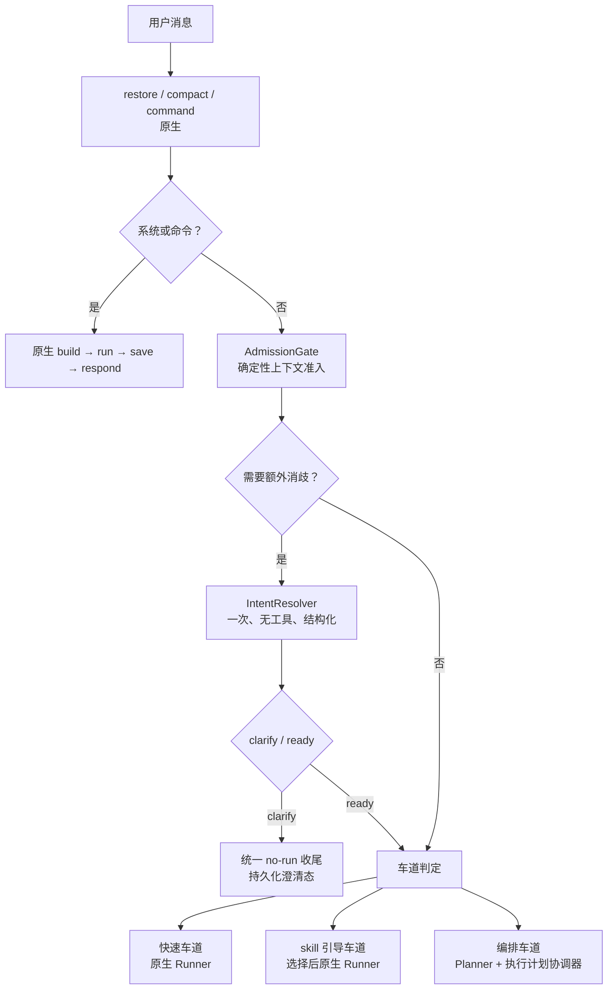

# 轻量优先执行规划技术设计

**版本：** v0.1（待评审）

**状态：** 技术设计提案；不得据此直接进入开发

**日期：** 2026-08-10

**权威基准：** [ADR-009：轻量优先三车道改造基准](../06_决策记录/ADR-009-轻量优先三车道改造基准.md)

**源码依据：** `nanobot/agent/loop.py`、`context.py`、`skills.py`、`runner.py`、`subagent.py`、`tools/spawn.py`、`session/manager.py`

**输入契约：** [模型输入输出契约](./模型输入输出契约.md)

## 1. 设计结论

本次改造不应在每条消息前追加一个“意图 LLM + Planner LLM”，也不应把完整任务图常驻到每个会话。最小架构是：

1. 用确定性准入门识别只有在缺少对象、歧义续办或待澄清状态下才需要额外判断的回合。
2. 普通问答、明确单步骤动作继续进入原 `AgentRunner`；仅在 skill 命中时按需绑定 skill 正文。
3. 仅把已证明具有多目标、依赖、并行、后台或跨回合收益的任务交给无工具 Planner。
4. 用只负责“计划节点启动、结果路由和终答门”的**执行计划协调器**复用现有 `AgentRunner` 与 `SubagentManager`，不另造通用任务引擎。

它解决“主 agent 默认自己做”和“skill 只躺在目录里”的问题，同时不把简单任务变成多轮模型调用的流水线。

## 2. 已确认事实与设计边界

| 类别 | 事实 / 决策 | 设计含义 |
| --- | --- | --- |
| 主链路 | 当前普通回合为 `restore → compact → command → build → run → save → respond`。 | 新插点在 `command` 后，不能复制或绕开既有持久化、交付收尾。 |
| 运行时 | runtime 在 `_build_turn()` 取得；该方法还会做 consolidation、provider state 暂存与用户消息早持久化。 | 拆出极小 `prepare_runtime_for_admission`，不能在完整 `build` 前后随意加模型调用。 |
| skill | 当前只会全量注入 `always` 和显式 `$skill`；其余只在目录摘要中等待模型自己读文件。 | 新增候选索引和选择器；所有 active skill 自动候选，但只有最终选择的正文入上下文。 |
| subagent | 当前 `spawn` 是模型自由工具调用；后台结果只带 `task_id` 和会话覆盖键，pending queue 不认识 `plan_id`。 | 计划模式禁止自由委派，并增加持久结果路由收据与计划级消费校验。 |
| 会话 | `Session.metadata` 可存版本化小状态；历史、memory 与 provider state 均不适合成为任务事实源。 | 只在需要跨回合时存紧凑 TaskFrame / RouteReceipt；结果正文不放入 metadata。 |
| 用户权限 | 明确任务与已有权限满足时直接执行；不因邮件等外部动作额外确认。 | 不增加权限系统或二次确认。 |

明确不做：全局 MCP/tool 推荐器、固定角色 subagent、每轮任务图、全量 skill 正文注入、节点级动态重建普通工具注册表、第三方 skill 市场治理。

## 3. 三车道与准入门



### 3.1 AdmissionGate：不是“每条消息的意图分类器”

它是确定性、无工具的风险门，只处理以下情况：

- 纯指代或续办表达（如“继续”“处理一下”“上面的那个”），但没有唯一可推进任务；
- 会话存在等待用户回答的 `ClarificationState`；
- 当前消息同时指向多个已确认但无关系的未完成任务；
- 明显缺少目标对象、范围或可解析引用，且不是自包含问答。

明确问答、明确单步骤任务、已有唯一任务的“继续”、斜杠命令和内部系统消息不会进入额外模型调用。这样“给客户发已拟邮件”“查一下天气”“解释这个概念”仍保持当前响应形态。

规则不能安全判定时，才调用一次 `IntentResolver`。它无工具、不可写 session/provider state，输出受 schema 限制的 `ready` 或 `clarify`，不能输出执行方案、工具选择或 subagent 数量。

### 3.2 澄清收尾

`clarify` 通过统一 `finish_non_execution_turn` 收尾：持久化当前用户输入和助手澄清问题，清空 provider staged state，不进行 memory consolidation、业务工具、subagent 或规划。若需要跨轮等待，保存小型 `ClarificationState`；它只含问题、候选引用、创建回合和版本，不是任务图。

用户对该问题的回答优先与该状态合并；若答案仍不唯一，再问一个聚焦问题。没有 `ClarificationState` 时，普通自包含问答仍交给原 Runner，而不是被误判为“无任务”。

## 4. Skill 自动使用：候选、绑定与回退

### 4.1 用户体验契约

- 用户新增的 active skill 默认可被自动选择；不要求给每个 skill 手工打“推荐”标签。
- `$skill` 仍然是本轮强制绑定；`disabled`、`manual`、`always` 是显式例外。
- 命中时界面只显示简短、可关闭的“已应用：技能名”；没有命中时不显示空状态，不打扰用户。
- skill 是工作流内容，不改变现有工具、MCP、账号、确认或安全权限。

### 4.2 数据模型与兼容性

扩展 `SkillsLoader` 的只读 `SkillDescriptor`，由既有 frontmatter 兼容生成：

```text
{ name, source, description, availability, missing_requirements,
  activation: auto | manual | always | disabled,
  optional_tags, optional_triggers, content_fingerprint }
```

没有新字段的旧 skill 一律视为 `activation=auto`；`description` 缺失时沿用当前名称回退。`tags` 与 `triggers` 只提高命中率，不是让用户完成配置的前置条件。描述、指纹和可用性组成紧凑索引；正文继续按需读取。

### 4.3 选择流程

1. 排除 disabled、手工仅用、不可用及被当前 `$` 显式覆盖的条目；`always` 保持现有语义。
2. 以当前消息、已锚定任务的目标/约束和 descriptor 做本地确定性召回（名称、描述、tags、triggers 的词项及短语匹配）。
3. 高置信单一候选直接绑定，不增加 LLM；无候选直接保持原路径。
4. 多个近似候选且预计能实质改变工作流时，才调用一次无工具 `SkillSelector`，输入仅为紧凑候选索引，输出为少量名称或“不绑定”。
5. `ContextBuilder` 接收最终 `bound_skill_names`，只注入这些正文和 `always` 正文；其余保留紧凑目录摘要，兼容原模型的自主读文件能力。

正文数量和总 token 预算必须配置化，并在真实回放后定默认值；选择器遇到预算溢出、读取失败、结果不合法或低置信度时安全降级为“不自动绑定”，不阻塞原 Runner。

## 5. 编排车道：何时规划，何时绝不规划

### 5.1 进入条件

进入编排车道必须同时具备可验证的任务对象与至少一个明确收益信号：

- 两个或更多有独立交付物和验收的工作单元；
- 已知前后依赖，需要跨步骤传递结果；
- 只读工作可独立并行，且并行缩短关键路径；
- 用户明确要求后台、并行、分工或稍后汇报；
- 已确认的跨回合 TaskFrame 存在多个关系明确的 ready 节点。

以下情况禁止规划：单一行动、只有“可以多想想”的抽象要求、共享写目标冲突不清、输入/验收不完整、subagent 容量不可用且不存在顺序收益、无对象或多候选未澄清。

复杂不是按“字数多”或“代码任务”判断；一封明确要发送的邮件是快速车道，多源调研并形成对比结论才可能是编排车道。

### 5.2 Planner 输入与输出

Planner 只在编排车道运行一次，无业务工具。输入是经过裁剪的 `PlanInput`：

```text
{ task_id, goal, scope, constraints, acceptance,
  evidence_refs, selected_skill_summaries,
  subagent_available, concurrency_limit, known_resource_claims }
```

它不接收完整会话、memory 原文、全量工具/MCP schema、账号信息或未信任附件指令。输出以代码生成的 `plan_id` 为载体：

```text
ExecutionPlan {
  plan_id, task_frame_id?, delivery_mode: join_now | background_notify,
  nodes: [{ node_id, actor: parent | subagent, goal, input_refs,
            deliverable, acceptance, depends_on, resource_claims }]
}
```

计划验证器拒绝环、空交付物、未知证据、无验收的 subagent、无界节点数、未声明共享写入冲突和不满足的依赖。验证失败降级为单 parent Runner，而不是让模型自由 `spawn`。

### 5.3 执行计划协调器，而不是第二个 Runner

新增 `ExecutionPlanCoordinator`（执行计划协调器），职责严格限于：

1. 根据已验证 plan 启动 ready 的 subagent 节点，复用 `SubagentManager` 的工具隔离、取消、运行时与状态事件。
2. 为 parent 节点调用现有 `AgentRunner`，将当前节点、已完成结果引用与验收条件作为受控 Runtime Context。
3. 维护依赖前沿、终答门和失败/取消状态。
4. 将每次委派与结果绑定到持久化 RouteReceipt。

计划模式的 parent Runner 不得自行决定额外委派。其可见的 `spawn` 必须被计划作用域禁用；正常车道和 feature flag 关闭时保留当前 `SpawnTool` 语义。这样规划决定“是否、派谁、交付什么”，Runner 仍只负责既有工具循环和实际执行。

subagent 获得的输入是已验证节点任务、必要证据摘要、交付物与验收，不继承父会话全文；其普通工具注册、MCP 可用性和既有权限限制保持不变。

协调器替代 LLM 的只是**控制面合龙**，不替代 LLM 的**语义合龙**：

| 合龙工作 | 负责者 | 依据 |
| --- | --- | --- |
| 结果是否属于当前会话、计划和节点 | 协调器 | RouteReceipt 的确定性字段校验 |
| 是否重复、过期、取消，能否释放后继节点 | 协调器 | 节点状态机与依赖关系 |
| 必需节点是否都已完成，是否允许最终调用 | 协调器 | 已验证 ExecutionPlan |
| 多个结果如何解释、取舍、发现矛盾与组织用户答复 | 既有主 Agent / Runner LLM | 受控的计划上下文、节点结果与用户目标 |
| 需要补充工作时的计划建议 | Planner / 主 Agent LLM | 受限输入；新计划仍须通过代码验证器 |

当前 nanobot 是“任一 subagent 结果作为内部消息推回主 LLM，再由主 LLM 临场决定下一步”。新方案改为“协调器先完成确定性的路由、依赖和完成资格判断；只有合格结果与合格时机才交给主 LLM 做语义整合”。这避免 LLM 把旧结果、其他计划结果或尚未完成的分支误当作可直接终答的输入。

## 6. 结果路由、汇合与完成门

### 6.1 持久 RouteReceipt

在启动子任务前，先向父会话的 `metadata["orchestration.v1"]` 写入有版本和 TTL 的收据：

```text
RouteReceipt {
  task_id, parent_session_key, plan_id, node_id,
  status: reserved | running | deferred | consumed | cancelled,
  expires_at, result_ref?
}
```

`task_id` 需先预留、再持久化收据、最后启动，避免 `SubagentManager` 清理内存登记与消息消费竞争。收据只存身份、状态和结果引用，绝不存完整结果正文。

### 6.2 消费前校验

内部结果必须携带同一组 `{task_id, parent_session_key, plan_id, node_id}`。`AgentLoop` 在放入通用 pending queue 之前完成下列校验：

1. 只接受内部 `system/subagent` 结果 envelope。
2. `session_key_override`、envelope 与父会话收据三者完全一致。
3. receipt 当前状态允许本次结果，且未过期、未取消、未消费。
4. 结果所属 `plan_id` 正好是该活跃执行切片，才可作为当前模型的内部输入。

任何未知、重复、跨会话、跨计划或字段不一致结果都隔离审计，不能写入 history、memory、provider state、pending queue 或用户输出。

合法但当前不应消费的结果存为受限结果 artifact，并把 receipt 标为 `deferred`。它不会污染正在处理的另一项任务；用户回到原任务，或该任务明确处于 `background_notify` 且没有新任务冲突时，才按原计划消费。

### 6.3 用户可见行为

- `join_now`：子节点未完成前缓冲 parent 的候选终答；工具进度可照常显示，最终文本只在汇合、失败或明确超时后交付。
- `background_notify`：只在用户明确要求后台/稍后汇报时使用。开始时给即时状态，完成时只向原会话且原计划仍有效的路由发送完成更新；若用户已切换到新任务则递延，不打断新任务。
- WebUI 生命周期事件沿用当前 `started/completed/failed`，可补充 `plan_id` 作为内部关联字段；快速和无 skill 命中回合不产生编排 UI 噪音。

## 7. 状态归属、接口契约与数据保留

| 对象 | 唯一可信源 | 生命周期 | 模型是否直接可见 |
| --- | --- | --- | --- |
| `ClarificationState` | `Session.metadata[orchestration.v1]` | 直到回答、取消或过期 | 仅紧凑受控投影 |
| `TaskFrame` | 同上 | 仅复杂/跨回合任务 | 仅当前前沿投影 |
| `ExecutionPlan` | 运行内存 + 可恢复的紧凑摘要 | 单执行切片 | 当前节点指令，不暴露内部推理 |
| `RouteReceipt` | 父 session metadata | 从预留到消费/TTL | 否 |
| 子任务结果 | 受限 artifact 文件 | 按现有会话/文件保留策略 | 仅消费时按预算注入 |
| 历史 / memory / provider state | 原有机制 | 原语义 | 不是任务事实源 |

新增 `RequestContext.attributes["orchestration"]` 仅携带不可变的当回合快照（lane、task/frame、plan/node、bound skills）。工具不能以该属性抬升能力；`SpawnTool` 只在计划作用域读取它来拒绝未授权的自由委派。

元数据必须带 schema version、条目上限、字符上限和 TTL；解析失败按 fail-closed 处理：清理不可解析条目、记录告警、进入澄清或原生非委派路径，绝不猜测恢复计划。

## 8. 最小代码插点

| 位置 | 变更 | 保持不动 |
| --- | --- | --- |
| `nanobot/agent/loop.py` | command 后新增 admission 准备/分流；拆出 no-run 收尾；内部结果入队前调用 router。 | `restore`、`compact`、常规 `build/run/save/respond` 顺序与普通会话锁。 |
| `nanobot/agent/context.py` | 接受绑定 skill 与 orchestration runtime block。 | 系统提示、记忆、历史、工具契约装配语义。 |
| `nanobot/agent/skills.py` | 生成 descriptor、索引和按预算加载。 | 目录优先级、disabled、`$skill`、`always` 兼容。 |
| 新增轻量模块 | `admission`、`skill_selection`、`orchestration/models`、`result_router`、`plan_coordinator`。 | 不改写 `AgentRunner` 工具循环。 |
| `nanobot/agent/subagent.py` | 接收预留 task id 与 route envelope，仍负责实际子 agent 生命周期。 | 独立工具表、取消、结果预算、状态事件。 |
| `nanobot/agent/tools/spawn.py` | 仅在计划作用域拒绝 parent 的自由 spawn；flag 关闭完全兼容。 | 正常模式输入、权限和后台行为。 |
| `Session.metadata` | 增加 `orchestration.v1` 命名空间。 | 既有 goal、memory、provider state 格式。 |

## 9. 失败降级与安全

| 失败点 | 行为 |
| --- | --- |
| Admission / Intent schema 无效 | 不执行工具；给出聚焦澄清。 |
| Skill 选择器失败或超预算 | 不自动绑定正文，保留原 Runner 与目录摘要。 |
| Planner 无效、容量不足或资源冲突 | 降级单 parent，不自由 spawn；若任务本身无法安全执行则说明阻塞。 |
| 子 agent 失败 / 取消 / 超时 | 节点标记失败；由完成门输出真实未完成情况，不能伪造终答。 |
| Receipt 不匹配 | 隔离并审计，零注入、零外发。 |
| 重启 / 计划替换 / `/stop` | 旧计划设为 cancelled 或 deferred；旧结果不能满足新 plan。 |

现有工具权限、MCP 连接、工作区 sandbox、用户确认策略继续是最终安全边界。skill、Intent、Planner 与 route metadata 一律不被视为授权来源；所有模型输出都经 schema 和服务端校验。

## 10. 实施顺序与不可跨越的验证门

1. **零侵入观测切片**：只记录候选车道、skill 召回和潜在委派收益，不改变输出和工具。用真实回放建立基线。
2. **skill 引导切片**：实现 descriptor 与高置信自动绑定；验证无命中零正文、`$skill/always/disabled` 兼容、30 skills 的上下文预算。
3. **准入与澄清切片**：启用无对象/多候选保护与统一 no-run 收尾；验证普通问答和明确行动不增加独立 LLM 往返。
4. **计划串行切片**：实现 TaskFrame、Planner、receipt 与单个/串行 subagent，不启用后台并行。
5. **受控并行与后台切片**：加入计划级结果路由、终答门、递延和 WebUI 最小状态。

每一切片均必须在隔离 worktree 完成，feature flag 默认关闭，并满足对应真实回放与回归测试后才可扩大。不得以“架构已经设计完”为由跳过观测或直接改动正在使用的实例。

## 11. 未决参数与验证

| 项目 | 推荐处理 | 所需证据 |
| --- | --- | --- |
| skill 正文预算、最多自动绑定数 | 配置化；先以回放找上下文/命中率拐点。 | 30 skill 语料的 token、命中、任务成功率。 |
| SkillSelector 触发置信区间 | 只在近似多候选且 workflow 差异显著时调用。 | 误绑率、额外调用率和用户纠正率。 |
| 计划节点 / 并发上限 | 必须有硬上限，具体默认值跟随资源与成本评测。 | 真实时延、失败率、主上下文节省。 |
| background_notify 默认 | V1 仅用户明确要求时启用。 | 用户对中断式完成通知的接受度。 |
| 结果 artifact 保留期 | 与现有 session / 文件清理策略对齐，不能无限增长。 | 存储增长与恢复需求。 |

## 12. 架构自检

- **状态在哪：** 跨回合事实只在版本化 session metadata，结果正文在 artifact，运行时计划在 adapter；没有把任务事实藏在 history 或 provider state。
- **反馈在哪：** 车道、skill 绑定、plan/receipt 状态以结构化日志和既有 runtime event 观测；具体阈值由回放后设定。
- **删了会炸哪：** feature flag 关闭时整套新模块不参与；删除协调器不改变原 Runner、ToolRegistry、MCP、memory 或 subagent 旧路径。

仍未验证：中文 skill 召回质量、不同 provider 的结构化输出兼容性、结果 artifact 的现有清理边界、并行对真实任务成功率和主上下文占用的净收益。这些是进入开发前必须验证的风险，不应以设计推测替代。
